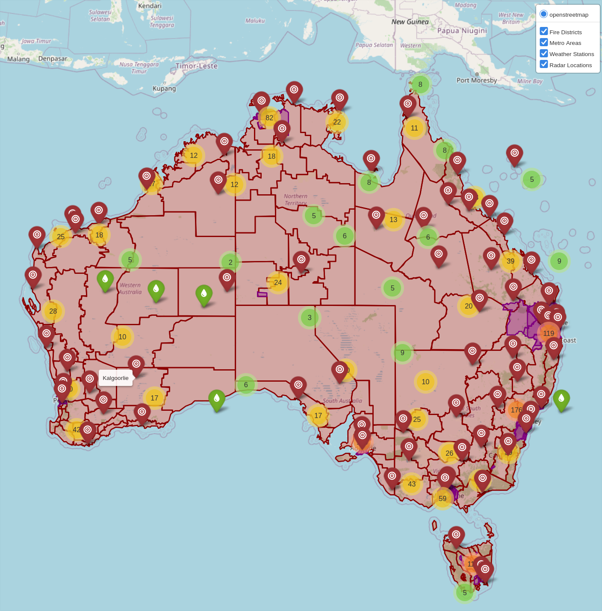
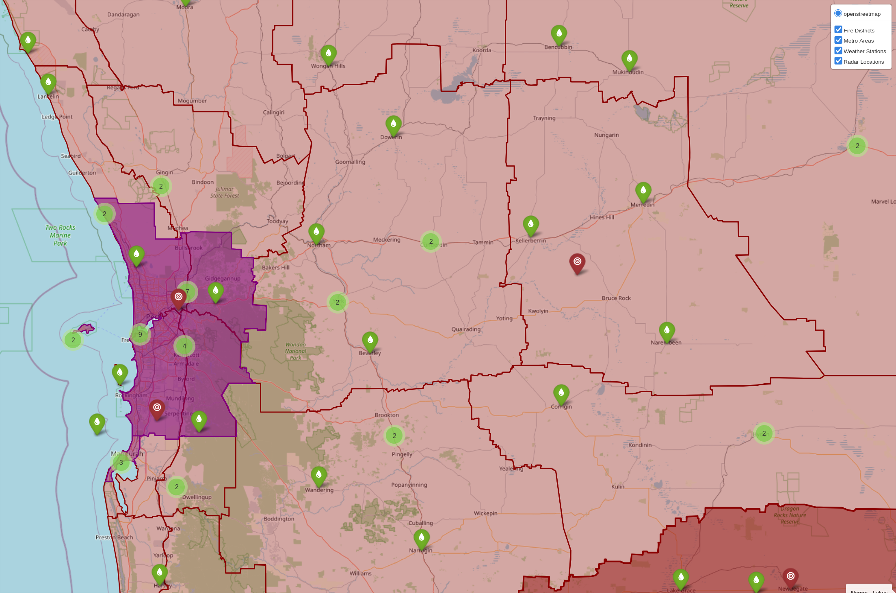

========
Overview
========

|

.. image:: https://readthedocs.org/projects/bomshell/badge/?version=latest
   :target: http://bomshell.readthedocs.io/en/latest/?badge=latest
   :alt: Documentation Status

``bomshell`` retrieves weather data from the `Australian Bureau of Meteorology (BOM) <http://www.bom.gov.au/>`_.
Get forecasts in the terminal, fetch spatial data (shapefiles), build a local SQLite database, and generate
interactive maps — all from the command line.

Quick Start
===========

.. code::

    $ uv tool install bomshell

    $ bomshell
    Roleystone, WA 6111

    Tue 10 Feb — Mostly sunny. (29°/16°)
      Rain: 5% chance | UV: extreme (12) | Fire: High
      Mostly sunny. Winds southeasterly 25 to 40 km/h turning easterly
      25 to 35 km/h in the evening.

    Wed 11 Feb — Wind easing. Sunny. (28°/13°)
      Rain: 0% chance | UV: extreme (12) | Fire: High
      Sunny. Winds easterly 30 to 45 km/h.

    Thu 12 Feb — Sunny. (31°/15°)
      Rain: 0% chance | UV: extreme (12) | Fire: Moderate
      Sunny. Winds easterly 25 to 35 km/h turning southerly 15 to 20 km/h
      during the afternoon then becoming light during the evening.

    ...

With no arguments ``bomshell`` shows the 7-day forecast for the default town
(Roleystone). Pass a town name to look up somewhere else:

.. code::

    $ bomshell forecast Perth
    $ bomshell forecast "Byron Bay"

JSON Output
===========

Every command supports ``--json`` for machine-readable output, useful for
status-bar widgets (waybar, i3blocks, etc.):

.. code::

    $ bomshell --json forecast Perth
    {
      "location": {"geohash": "...", "name": "Perth", ...},
      "forecast": {"data": [...]}
    }

    $ bomshell --json knobs
    {
      "BOM_CACHE": "/home/user/.cache/bomshell",
      "BOM_FTP_TIMEOUT": 5,
      ...
    }

Installation
============

Using uv (recommended):

.. code::

    $ uv tool install bomshell

Using pip:

.. code::

    $ pip install bomshell

Config
======

``bomshell`` is configured using CLI options and a ``.bomshell`` settings file.
To see the valid knobs that can be tuned use the ``knobs`` command:

.. code::

    $ bomshell knobs

To create a fresh ``.bomshell`` config file:

.. code::

    $ bomshell knobs > ~/.bomshell

Spatial Data
============

Initial Setup
-------------

Fetch the spatial data (shapefiles) from BOM:

.. code::

   $ bomshell spatial fetch

This downloads all shapefile components (.dbf, .shp, .shx, .prj) to ``~/.cache/bomshell/spatial_cache/``.

Build the local SQLite database (optional, for database queries):

.. code::

   $ bomshell spatial build

Interactive Maps
----------------

Generate interactive HTML maps of BOM spatial data. Maps open automatically in your browser.

|

**Point data** (markers on map):

.. code::

   # Radar locations across Australia
   $ bomshell spatial map -s radar_location

   # All 1,475 weather observation points
   $ bomshell spatial map -s point_places

   # Radar coverage areas
   $ bomshell spatial map -s radar_coverage

**Polygon data** (district/zone boundaries with hover highlighting):

.. code::

   # Weather forecast districts
   $ bomshell spatial map -s forecast_districts

   # Fire weather districts
   $ bomshell spatial map -s fire_districts

   # Marine forecast zones
   $ bomshell spatial map -s marine_zones

   # Rainfall districts
   $ bomshell spatial map -s rainfall_districts

   # Metropolitan areas
   $ bomshell spatial map -s metros

   # Tropical cyclone warning areas
   $ bomshell spatial map -s cyclone_areas

   # High seas forecast areas
   $ bomshell spatial map -s high_sea_areas

   # Ocean wind warning areas
   $ bomshell spatial map -s ocean_wind_warning

**Combined maps** (multiple layers with toggle control):

.. code::

   # Radar locations over forecast districts
   $ bomshell spatial map -s forecast_districts -s radar_location

   # Fire districts with weather stations
   $ bomshell spatial map -s fire_districts -s point_places

   # Multiple polygon layers
   $ bomshell spatial map -s forecast_districts -s marine_zones -s radar_location

Combined maps include a layer control (top-right) to toggle each layer on/off.

Map options:

.. code::

   # Save to custom location
   $ bomshell spatial map -s radar_location -o ~/maps/radars.html

   # Don't open browser automatically
   $ bomshell spatial map -s forecast_districts --no-open

Maps are saved to ``~/.cache/bomshell/`` by default.

Data Export
-----------

Export spatial data to Rich tables or CSV:

.. code::

   # View as formatted table
   $ bomshell spatial tabledump -s radar_coverage

   # Export to CSV
   $ bomshell spatial csvdump -s point_places > places.csv

   # Export as JSON
   $ bomshell --json spatial tabledump -s radar_coverage

Available Spatial Types
-----------------------

===================  ===========  =====================================================
Type                 Data Format  Description
===================  ===========  =====================================================
forecast_districts   Polygon      Weather forecast districts by state
marine_zones         Polygon      Marine and coastal forecast zones
fire_districts       Polygon      Fire weather forecast districts
rainfall_districts   Polygon      Rainfall reporting districts
cyclone_areas        Polygon      Tropical cyclone warning areas
high_sea_areas       Polygon      High seas forecast areas
metros               Polygon      Metropolitan forecast areas
ocean_wind_warning   Polygon      Ocean wind warning zones
radar_location       Point        BOM radar station locations
radar_coverage       Point        Radar coverage information
point_places         Point        Weather observation stations (1,475 locations)
===================  ===========  =====================================================

Development
===========

.. code::

   # Clone and install
   $ git clone https://github.com/sthysel/bomshell
   $ cd bomshell
   $ uv sync --all-extras

   # Run tests
   $ just test

   # Run linting
   $ just lint

   # See all available commands
   $ just
